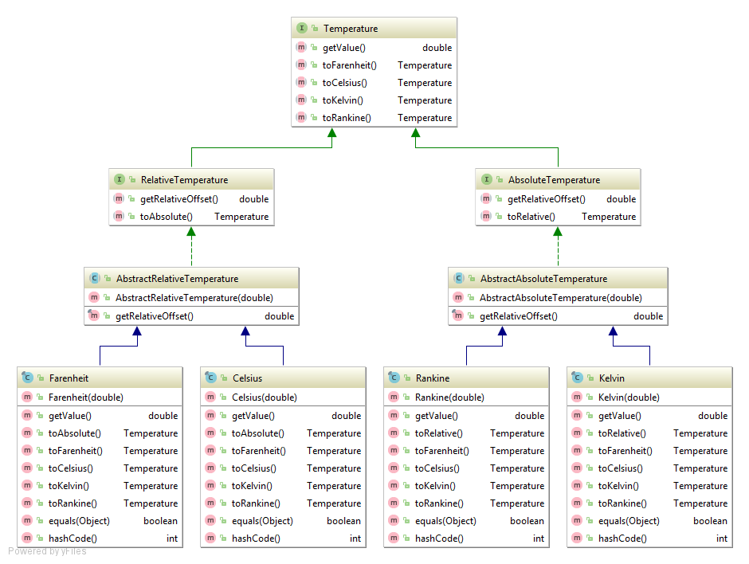

## Interactive Development with Reloadable Code
Mark Bastian
<br>November 9, 2017

----

# Overview
* Time
* Reloadable Code
* Solutions
* Demos

---

# The Time Problem

----

### Time: How much time do you spend...
* ...waiting for code to compile?
* ...getting your application into a testable/debuggable state?
* ...doing actual coding?

----

### Development Models & The Feature Feedback Loop
| Model               | Cycle Time        | Tooling       | State |
| ------------------- | ----------------- |:-------------:| -----:|
| Edit, Compile, Run  | Minutes-Hours     | Static        | Lost  |
| Edit, Save, Refresh | Seconds-Minutes   | Dynamic       | Lost  |
| Edit, Save, Reload  | Immediate-Seconds | Dynamic       | Saved |

---

## Example: Temperature Converter App

----

## Start with Basic Frame

```java
public class Main {
    public static void main(String[] args){
        JFrame app = new JFrame("F2C");
        app.setSize(400, 150);
        app.setLayout(new BorderLayout());
        app.setDefaultCloseOperation(WindowConstants.EXIT_ON_CLOSE);
        app.setVisible(true);
    }
}
```

----

## Run it!


----

## Add UI Elements

```java
public class Main {
    public static void main(String[] args){
        JFrame app = new JFrame("F2C");
        app.setSize(400, 150);
        app.setLayout(new BorderLayout());
        app.setDefaultCloseOperation(WindowConstants.EXIT_ON_CLOSE);

        //The Celsius box
        Box cRow = Box.createHorizontalBox();
        cRow.add(new JLabel("C: "));
        JTextField cField = new JTextField();
        cRow.add(cField);

        //The Farenheit box
        Box fRow = Box.createHorizontalBox();
        fRow.add(new JLabel("F: "));
        JTextField fField = new JTextField();
        fRow.add(fField);

        //The temp box containers
        Box box = Box.createVerticalBox();
        box.add(cRow);
        box.add(fRow);
        app.add(box, BorderLayout.CENTER);

        app.setVisible(true);
    }
}
```

----

## Run it!


----

## Step 3: Add Model


----

## Step 4: Implement Model


----

## Step 5: Other details
* Listeners
* PropertyChangeSupport
* As you add new features:


----

## Additional Steps
* Ensure model correctness
* Attach model to UI
* With every change:


----

## What if I could reload?
* JShell?
* Model value and behavior are complected
* Most changes = full reload

---

## Reducing Development Time with Reloadability

----

### What is Reloadable Code
* Change code
* Initiate editor refresh
* Only desired changes are propagated
* No manual client refresh or state restoration
* No relaunches - one process!

----

## Requirements
* A long running repl process
* Separated concerns
  * Value (fields)
  * Behavior (methods)
  * State (mutable fields + change support)

----

## REPL
* Read-Evaluate-Print-Loop
* A process that allows you to interactively develop code
* JShell
* Scala REPL
* Python Shell
* Clojure Repl

----

#### Complected State Model


----

#### Decomplected State Model
```clojure
(defonce state (atom {:celsius 100.0}))

(defn rankine->kelvin [r] (/ (* r 5.0) 9.0))
(defn kelvin->rankine [k] (/ (* k 9.0) 5.0))
(defn celsius->kelvin [c] (+ c 273.15))
(defn kelvin->celsius [c] (- c 273.15))
(defn farenheit->rankine [f] (+ f 459.67))
(defn rankine->farenheit [f] (- f 459.67))

(def farenheit->celsius
  (comp kelvin->celsius rankine->kelvin farenheit->rankine))

(def celsius->farenheit
  (comp rankine->farenheit kelvin->rankine celsius->kelvin))
```

---

# Solutions & Examples

----

## Solution: Reloadable Swing
* Define a single JFrame (e.g. using defonce)
* A REPL environment is required
* Alternatives?

----

## Solution: Quil
* “Clojure/ClojureScript library for creating interactive drawings and animations.” 
* http://quil.info
* sketches can be run as Java or JavaScript apps

----

## Solution: Figwheel
* "Figwheel builds your ClojureScript code and hot loads it into the browser as you are coding!"
* https://github.com/bhauman/lein-figwheel
* Can be used seamlessly with Reagent(React), Node, or plain JS
* Has a REPL and a host of other development and debugging tools
* Can use external client while coding

----

### Facilitating Reloadability
* State represented as value
* State management independent of value
* Behavior decomplected from state
* Interactivity

---

## Conclusions
<small>
* Reloadable code is a very effective and fun technique for rapid application development
* It drastically reduces development time and keeps the developer engaged
* Clojure(Script) approaches facilitate interactive development
  * Clojure's data-centric approach makes state continuity much easier than other approaches
  * Several options: REPL, Quil, Figwheel
* Give it a try!

</small>

---

# Extras

----

# Questions
* References
  * http://worrydream.com/dbx/
  * lighttable
  * quil
  * figwheel
  
----

## Some basic imports
```clojure
;I'm gonna use this stuff
(require 
  '[clojure.pprint :as pp]
  '[cheshire.core :as ch])
  
(import 
  '(javax.swing JFrame JTable JMenuBar JMenu JMenuItem JSeparator)
  '(java.awt BorderLayout)
  '(java.awt.event ActionListener)
  '(javax.swing.table DefaultTableModel))
```

----

## Defining the Frame
```clojure
;I'm gonna use this stiff
(defonce frame (JFrame. "Reloadable"))

(defonce state (atom [["ABC" 123]
                      ["U" "Me"]]))
```

----

## Basic Swing
```clojure
(doto frame
  (.setLayout (BorderLayout.))
  (.setSize 800 600)
  (.setVisible true)
  (.revalidate))
```

----

## Add a Table
```clojure
(defn model [state]
  (proxy [DefaultTableModel] []
    (getRowCount [] (-> @state count))
    (getColumnCount [] (-> @state first count))
    (getValueAt [row col] (get-in @state [row col]))))
    
(doto frame
  (.add (JTable. (model state)) BorderLayout/CENTER)
  (.revalidate))
```

----

## Add a Menubar
```clojure
(defn add-action [component action-fn]
  (.addActionListener
    component
    (reify ActionListener
      (actionPerformed [this event]
        (action-fn event)))))
        
(doto frame
  (.setJMenuBar (doto (JMenuBar.)
                  (.add (doto (JMenu. "File")
                          (.add (doto (JMenuItem. "Open...")
                                  (add-action (fn [_] (prn "load")))))
                          (.add (JMenuItem. "Save..."))
                          (.add (JMenuItem. "Save as..."))
                          (.add (JSeparator.))
                          (.add (doto (JMenuItem. "Exit")
                                  (add-action #(pp/pprint (bean %)))))))
                  (.add (doto (JMenu. "Edit")))
                  (.add (doto (JMenu. "Tools")))
                  (.add (doto (JMenu. "Help")))))
  (.revalidate))
```

----

### We spend most of our time in a development feature feedback loop
* You exit the loop when the feature is complete
* The loop starts again with a new feature or when you need to improve/debug an existing feature

----

### Developer time is precious
* We want to maximize actual coding time
* This also minimizes time to deployment

----
---

# Fundamentals

----

### Clojure(Script)
<small>
* Clojure is a modern Lisp dialect that is hosted on the JVM
  * Compiles to JVM bytecode
  * Data oriented and functional
* ClojureScript is a dialect of Clojure
  * Very few differences
  * Uses the Google Closure compiler to transpile Clojure code into JavaScript
* Both interop very well in both directions with their host platforms
  * Makes use of wide variety of existing libraries (Maven central, npm)
* Learn more at https://clojure.org/ and https://clojurescript.org/
* Clojure's design facilitates reloadable code

</small>

----

### Data
```clojure
[1 3 :3 "4"] ;A vector
{:name "Mark"} ;A map
#{:A "B" \C 1} ;A set 
'(2 3) ;A list
```
<small>Clojure state is typically modeled using these structures</small>

----

### Behavior
```clojure
;A regular function
(defn my-function [arg-1 arg-2]
  (+ arg-1 arg-2))
  
;A lambda
#(+ %1 %2)

;As seen previously
(defn rankine->kelvin [r] (/ (* r 5.0) 9.0))
```
----

### Compared

```clojure
;Non-idiomatic
(rankine->farenheit (kelvin->rankine (celsius->kelvin 100.0)))
```

```clojure
;Idiomatic
(-> 100.0 celsius->kelvin kelvin->rankine rankine->farenheit)
```

```java
;Java
new Celsius(100.0).toKelvin().toRankine().toFarenheit().getValue();
```

<small class="fragment">You should avoid languages with lots of parenthesis!</small>

----

### Interop
Clojure
```clojure
(def frame (JFrame.))
```
Java
```java
JFrame frame = new JFrame();
```


