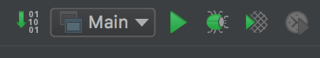
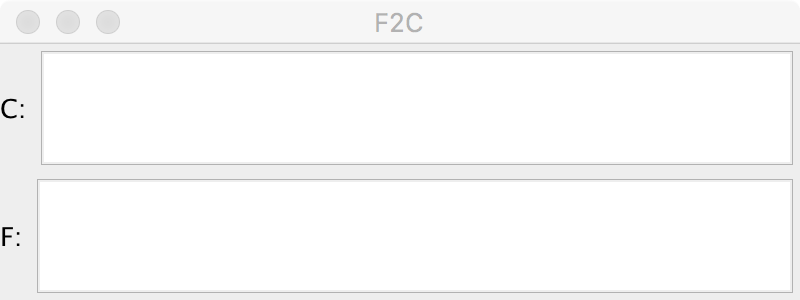

## Interactive Development with Reloadable Code
Mark Bastian
<br>November 9, 2017

---

## Motivating Example:
## Develop a Temperature Converter

----

## Start with Basic Frame

```java
public class Main {
    public static void main(String[] args){
        JFrame app = new JFrame("F2C");
        app.setSize(400, 150);
        app.setLayout(new BorderLayout());
        app.setDefaultCloseOperation(WindowConstants.EXIT_ON_CLOSE);
        app.setVisible(true);
    }
}
```

----

## Run it!



----

## Add UI Elements

```java
public class Main {
    public static void main(String[] args){
        JFrame app = new JFrame("F2C");
        app.setSize(400, 150);
        app.setLayout(new BorderLayout());
        app.setDefaultCloseOperation(WindowConstants.EXIT_ON_CLOSE);

        //The Celsius box
        Box cRow = Box.createHorizontalBox();
        cRow.add(new JLabel("C: "));
        JTextField cField = new JTextField();
        cRow.add(cField);

        //The Farenheit box
        Box fRow = Box.createHorizontalBox();
        fRow.add(new JLabel("F: "));
        JTextField fField = new JTextField();
        fRow.add(fField);

        //The temp box containers
        Box box = Box.createVerticalBox();
        box.add(cRow);
        box.add(fRow);
        app.add(box, BorderLayout.CENTER);

        app.setVisible(true);
    }
}
```

----

## Run it!



----

## Step 3: Add Model


----

## Step 4: Implement Model

```java
Temperature model = new Celcius(100.0);
```

----

## Step 5: Other details
* Listeners (e.g. UI events, model change events)
* PropertyChangeSupport (e.g. Model<->View sync)
* As you add new features:


----

## Additional Steps
* Ensure model correctness
* Attach model to UI
* With every change:


----

## What if I could...
* Launch my program once
* Update code (behavior or state)
* Immediately see the effects
* While preserving state

---

# Reloadable Code

----

### What is Reloadable Code
* Application in a long-running process
* Change code
* Trigger refresh (e.g. save source, execute command)
* Changes are propagated
* No
   * manual client refresh
   * loss of state
   * relaunches

----

## Facilitating Reloadability
* Interactive environment (REPL)
* Separation of concerns
  * Value
  * Behavior
  * State

---

# Solutions & Examples

----

## Solution: Reloadable Swing
* The reloadable version of our motivating example

----

## Solution: Figwheel
* "Figwheel builds your ClojureScript code and hot loads it into the browser as you are coding!"
* https://github.com/bhauman/lein-figwheel
* Can be used seamlessly with Reagent(React), Node, or plain JS
* Has a REPL and a host of other development and debugging tools
* Can use external client while coding

----

## Solution: Quil
* “Clojure/ClojureScript library for creating interactive drawings and animations.” 
* http://quil.info
* sketches can be run as Java or JavaScript apps

---

## In Conclusion
* Reloadable code is interactive, productive, and fun
* Give it a try!
* [https://github.com/markbastian/reloadable](https://github.com/markbastian/reloadable)
* Questions?
